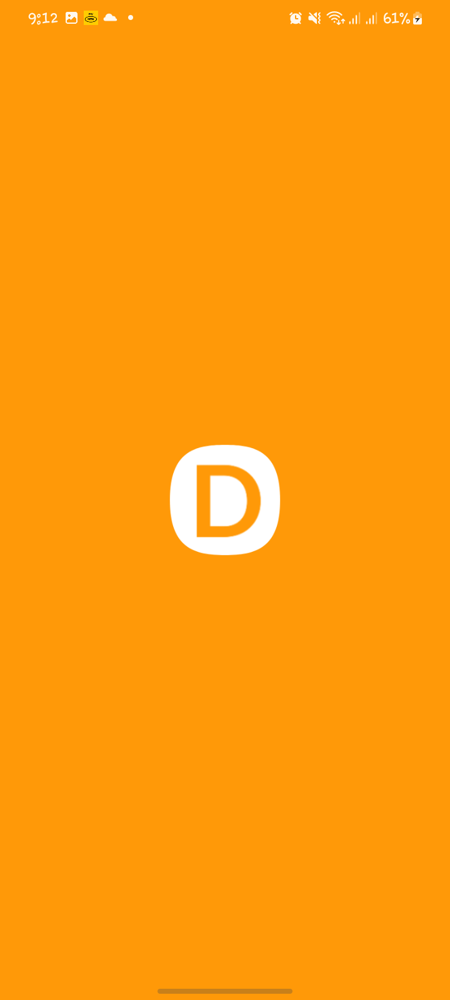
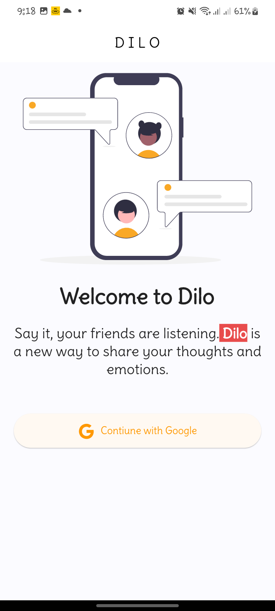
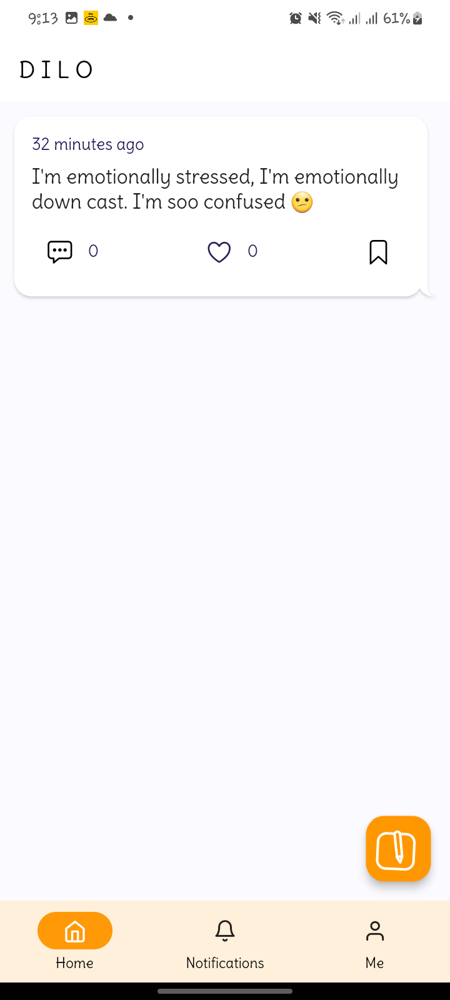
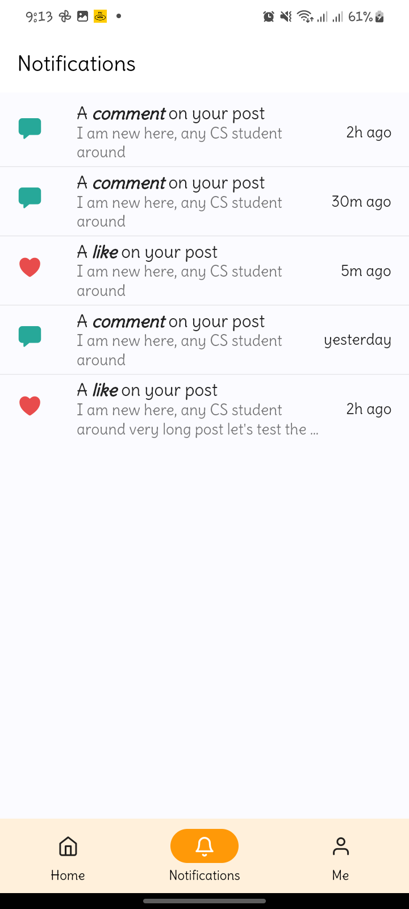
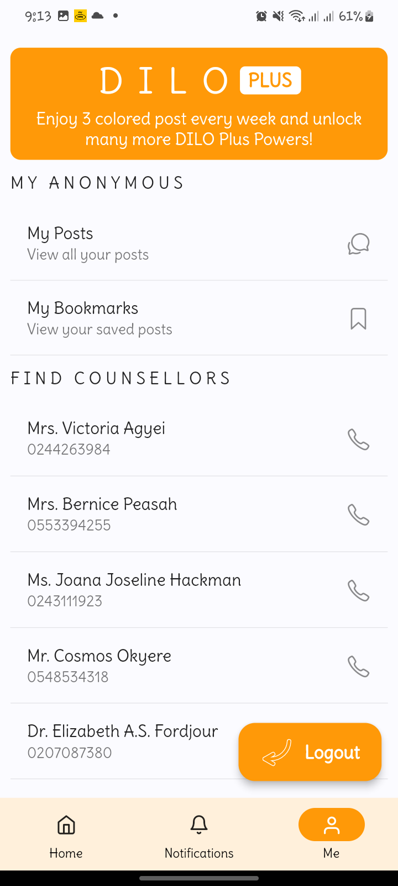
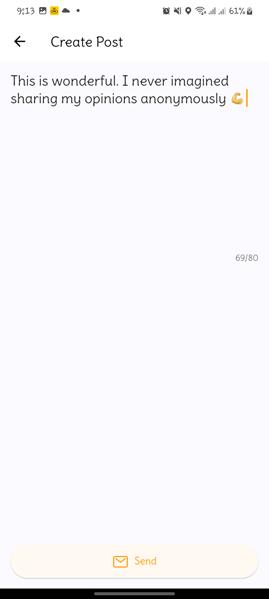
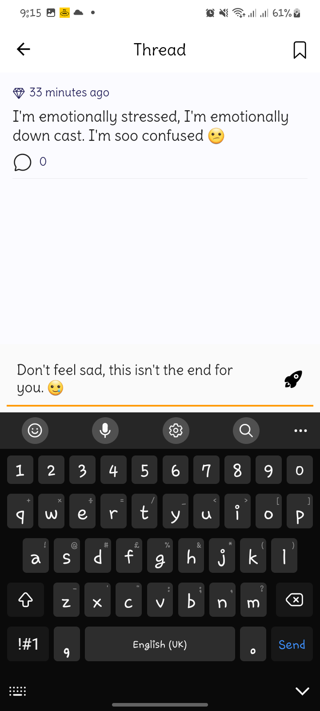
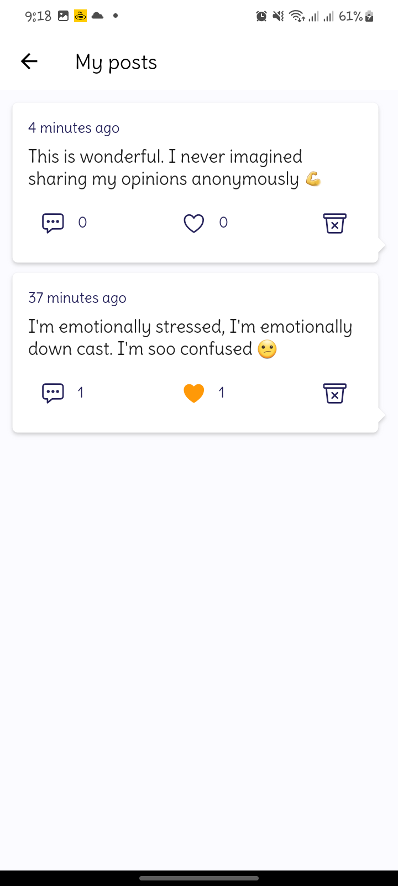

# Dilo

## Table of Contents

- [About](#about)
- [Getting Started](#getting_started)
- [Usage](#usage)
- [Contributing](../CONTRIBUTING.md)

## About <a name = "about"></a>

Dilo is a latin word which means _say it_. A new way to share and express your emotions. We're making it easy for students to

## Getting Started <a name = "getting_started"></a>

These instructions will get you a copy of the project up and running on your local machine for development and testing purposes. See [deployment](#deployment) for notes on how to deploy the project on a live system.

### Prerequisites

What things you need to install the software and how to install them.

```bash
Flutter and Dart SDK are required
```

### Installing

A step by step series of examples that tell you how to get a development env running.

```bash
git clone https://github.com/jeronasiedu/anon.git
```

```bash
cd anon
```

```bash
flutter pub get
```

You need to have firebase **sha256** and **sha1** key needed for the the authentication to

## Usage <a name = "usage"></a>

Feel free to contribute

# Screenshots

<p align="center">
  
&nbsp; &nbsp; &nbsp; &nbsp;
  
&nbsp; &nbsp; &nbsp; &nbsp;
  
&nbsp; &nbsp; &nbsp; &nbsp;
  
&nbsp; &nbsp; &nbsp; &nbsp;
  
&nbsp; &nbsp; &nbsp; &nbsp;
  
&nbsp; &nbsp; &nbsp; &nbsp;
  
&nbsp; &nbsp; &nbsp; &nbsp;
  
&nbsp; &nbsp; &nbsp; &nbsp;
  
</p>
